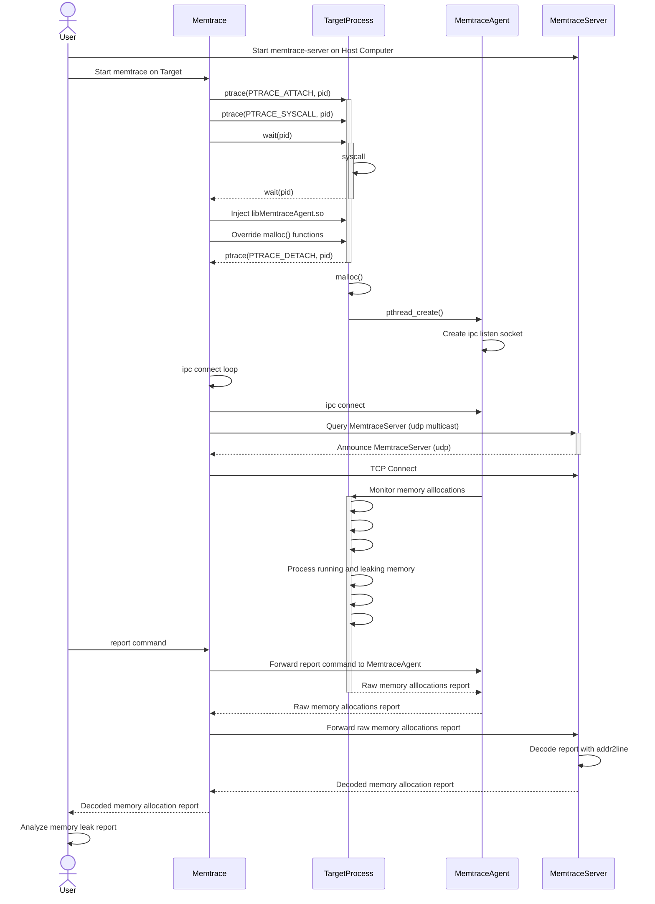

## 1. Overview
memtrace is a debugger allowing to trace memory allocations for debugging memory leaks targeted for Linux Embedded Systems.

It's main advantages are:

- It can be attached to a process already runninng
- Cross-debugging (No debug symbols needed on the target process)
- gdb support for inspecting memory allocation context
- Supported Platforms: x64, arm

## 2. Local debugging with MEMTRACE
### 2.1 Architecture



```
  HOST    ptrace   HOST
memtrace <------> process (with debug symbols)
addr2line
gdb
```

- memtrace retrieve the callstack of the target process each time it performs a memory allocation
- memtrace rely on addr2line and gdb to analyse callstack
- target process and libraries MUST have debug symbols

### 2.2 Compilation
```
$ cd memtrace
$ make
$ make install
```

### 2.3 Usage
```
memtrace [OPTION]... -p PID
memtrace [OPTION]... PROGRAM [ARG]...
```

## 3. Cross-debugging with MEMTRACE
### 3.1 Architecture

```
    HOST       TCP    TARGET   ptrace  TARGET
memtrace-fs <------> memtrace <------> process (without debug symbols)
stagingdir
gdb
addr2line
```

- memtrace can be attached to a process without debug symbols (Example: Embedded systems with limited flash memory)
- memtrace-fs provide addr2line and gdb tools to memtrace for callstack analysis
- memtrace-fs provide the libraries with debug symbols to memtrace through a TCP socket


### 3.2 Cross-Compilation
```
$ cd memtrace
$ export CC=arm-linux-gnueabi-gcc
$ make
$ make install
```

### 3.3 Local network
```
# Start memtrace-fs on Host.
# The service will listen on port 3002 and annouce itself with multicast.
# The service allow memtrace to retrieve debug symbols from staging directory
guillaume@ubuntu:~$ memtrace-fs output/staging/
Adding directory output/staging/ to search path
Listening on [::0]:3002
Waiting for client to connect


# Attach memtrace to process on Target
# memtrace will start to query memtrace-fs service with multicast and try to connect to it
# Once connected, it set breakpoints on allocation functions to track the memory
/cfg/system/root # /ext/memtrace -p $(pidof dnsmasq)
Query memtrace-fs service on [224.0.0.251]:3002
memtrace-fs announced on 192.168.1.104:3002
Connecting to [192.168.1.104]:3002
Connected
Ataching to pid 16563
Opening /sbin/dnsmasq begin=0xab0b2000 offset=10000
Opening /usr/lib/pcb/libpcb_serialize_odl.so begin=0xf6d58000 offset=0
Opening /usr/lib/pcb/libpcb_serialize_ddw.so begin=0xf6d81000 offset=0
Opening /lib/libnss_files.so.2 begin=0xf6d9c000 offset=0
Opening /lib/librt.so.1 begin=0xf6dbc000 offset=0
Opening /lib/libc.so.6 begin=0xf6dd3000 offset=0
Opening /lib/libsahtrace.so begin=0xf6f14000 offset=0
Opening /lib/libdl.so.2 begin=0xf6f27000 offset=0
Opening /lib/libpthread.so.0 begin=0xf6f3a000 offset=0
Opening /lib/libpcb_utils.so begin=0xf6f63000 offset=0
Opening /lib/libpcb_sl.so begin=0xf6f8c000 offset=0
Opening /lib/libpcb_dm.so begin=0xf6fa9000 offset=0
Opening /lib/libpcb_preload.so begin=0xf6ffb000 offset=0
Opening /lib/ld-2.26.so begin=0xf700d000 offset=0
Set breakpoint on malloc in /lib/libc.so.6:0x70ed8 (0xf6e43ed8)
Set breakpoint on calloc in /lib/libc.so.6:0x71d0c (0xf6e44d0c)
Set breakpoint on realloc in /lib/libc.so.6:0x71784 (0xf6e44784)
Set breakpoint on reallocarray in /lib/libc.so.6:0x74484 (0xf6e47484)
Set breakpoint on free in /lib/libc.so.6:0x7162c (0xf6e4462c)
```

### 3.4 Non local nework
When target is not running on local network, memtrace can not rely on multicast to discover memtrace-fs.
In this case, it is useful to start memtrace as a tcp server and memtrace-fs as a tcp client. Roles can be inverted if needed.

```
# Attach memtrace to process on Target
# memtrace will listen on tcp port 3002 and wait for memtrace-fs to connect
/cfg/system/root # /ext/memtrace -p $(pidof dnsmasq) -l 0.0.0.0
Listening on [0.0.0.0]:3002
Waiting for client to connect

# Ask memtrace-fs on Host to connect to memtrace on Target
guillaume@ubuntu:~$ memtrace-fs -c targethostname.com  workspace/ib3_12.02.12/output/staging/
Adding directory workspace/ib3_12.02.12/output/staging/ to search path
Connect to [targethostname.com]:3002
Connecting to [targethostname.com]:3002
Connected

# You should now have the hand on Target
## 4. Console Usage
memtrace provide a console to inspect the HEAP usage. It currently offers the following commands:
```
> help
List of commands:
       help: Display this help
       quit: Quit memtrace and show report
     status: Show memtrace status
    monitor: Monitor memory allocations
     report: Show memtrace report
      clear: Clear memory statistics
   coredump: Inspect memory alllocation with a coredump
        gdb: Inspect memory allocation with gdb
```

### 4.1 Show HEAP summary
This command allow to show the HEAP status.
  
Following the HEAP status evolution may help to detect when a program is leaking meory.
```
> status
HEAP SUMMARY Wed Feb 23 16:31:51 2022

    in use: 0 bytes in 0 blocks
    total heap usage: 205 allocs, 205 frees, 51885 bytes allocated
```

### 4.2 Clear current statistics
```
> clear
Clearing list of allocations
>
> status
HEAP SUMMARY Wed Feb 23 16:32:08 2022

    in use: 0 bytes in 0 blocks
    total heap usage: 0 allocs, 0 frees, 0 bytes allocated
>
```

### 4.3 Monitor the HEAP status
### 4.4 Show complete HEAP report with backtrace of each allocation
### 4.5 Generate a coredump for post-mortem analysis
### 4.6 Inspect Memory allocation with GDB


## 5. TODO
- Add MIPS support
- Improve this README
- Improve console support (move cursor)
