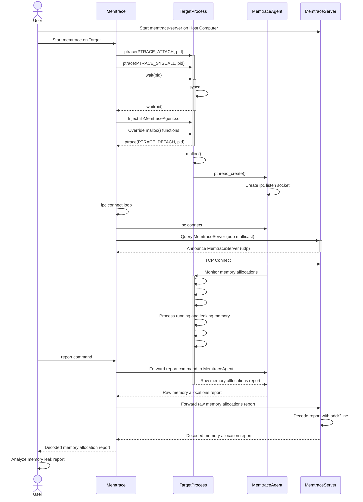

## 1. Overview
memtrace is a debugger allowing to trace memory allocations for debugging memory leaks targeted for Linux Embedded Systems.

It's main advantages are:

- It can be attached to a process already runninng
- Cross-debugging (No debug symbols needed on the target process)
- gdb support for inspecting memory allocation context
- Supported Platforms: x64, arm

## 2. Local debugging with MEMTRACE
### 2.1 Architecture



- memtrace inject an agent in the target process and override all memory allocations functions (malloc, calloc, realloc, free) with ptrace.
- The agent maintains the statistics and the callstack of the memory allocations done by the target process.
- memtrace can be attached to a process without debug symbols (Example: Embedded systems with limited flash memory)
- memtrace query the agent (status, report) through an ipc socket.
- memtrace-server provide addr2line and gdb tools to memtrace for callstack analysis

### 2.2 Compilation
```
$ cd memtrace
$ export CC=arm-linux-gnueabi-gcc
$ make
$ make install
```

### 2.3 Usage in local network for Cross-debugging.
```
# Start memtrace-server on Host.
# The service will listen on port 3002 and annouce itself with multicast.
# The service allow memtrace to retrieve debug symbols from build directory
guillaume@ubuntu:~$ memtrace-server output/staging/
Adding directory output/staging/ to search path
Listening on [0.0.0.0]:3002

# Attach memtrace to process on Target
# memtrace will:
# - inject the agent in target process to follow memory allocations
# - connect to the agent through ipc socket
# - query memtrace-server service with multicast and try to connect to it.
/cfg/system/root # /ext/memtrace -p $(pidof dnsmasq)
```

### 2.4 Non local nework
When target is not running on local network, memtrace can not rely on multicast to discover memtrace-server .
In this case, it is useful to start memtrace as a tcp server and memtrace-server as a tcp client. Roles can be inverted if needed.

```
# Attach memtrace to process on Target
# memtrace will listen on tcp port 3002 and wait for memtrace-fs to connect
/cfg/system/root # /ext/memtrace -p $(pidof dnsmasq) -l 0.0.0.0
Listening on [0.0.0.0]:3002
Waiting for client to connect

# Ask memtrace-server on Host to connect to memtrace on Target
guillaume@ubuntu:~$ memtrace-server -c targethostname.com  workspace/ib3_12.02.12/output/staging/
Adding directory workspace/ib3_12.02.12/output/staging/ to search path
Connect to [targethostname.com]:3002
Connecting to [targethostname.com]:3002
Connected

# You should now have the hand on Target
```
## 4. Console Usage
memtrace provide a console to inspect the HEAP usage. It currently offers the following commands:
```
> help
List of commands:
       help: Display this help
       quit: Quit memtrace and show report
     status: Show memtrace status
    monitor: Monitor memory allocations
     report: Show memtrace report
      clear: Clear memory statistics
   coredump: Inspect memory alllocation with a coredump
        gdb: Inspect memory allocation with gdb
```

### 4.1 Show HEAP summary
This command allow to show the HEAP status.
  
Following the HEAP status evolution may help to detect when a program is leaking meory.
```
> status
HEAP SUMMARY Wed Feb 23 16:31:51 2022

    in use: 0 bytes in 0 blocks
    total heap usage: 205 allocs, 205 frees, 51885 bytes allocated
```

### 4.2 Clear current statistics
```
> clear
Clearing list of allocations
>
> status
HEAP SUMMARY Wed Feb 23 16:32:08 2022

    in use: 0 bytes in 0 blocks
    total heap usage: 0 allocs, 0 frees, 0 bytes allocated
>
```

### 4.3 Monitor the HEAP status
### 4.4 Show complete HEAP report with backtrace of each allocation
### 4.5 Generate a coredump for post-mortem analysis
### 4.6 Inspect Memory allocation with GDB


## 5. TODO
- memtrace hang when can not connect to agent ipc socket
- Should we load pthread library ?
- GDB callstack ?
- Add MIPS support
- Send coredump notification in a dedicated socket to avoid concurrency issues. (One socket for request, one socket for notification).
- Improve this README
- Improve console support (move cursor)
- Add support for IFUNC
