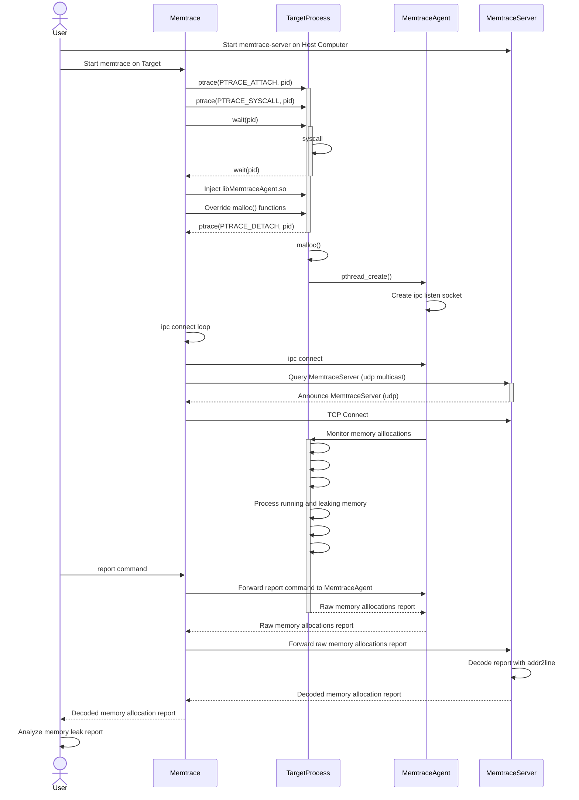

## 1. Overview
memtrace is a debugger allowing to trace memory allocations for debugging memory leaks targeted for Linux Embedded Systems.

It's main advantages are:

- It can be attached to a process already runninng
- Cross-debugging (No debug symbols needed on the target process)
- gdb support for inspecting memory allocation context
- Supported Platforms: x64, arm

## 2. Local debugging with MEMTRACE
### 2.1 Architecture



- memtrace inject an agent in the target process and override all memory allocations functions (malloc, calloc, realloc, free) with ptrace.
- The agent maintains the statistics and the callstack of the memory allocations done by the target process.
- memtrace can be attached to a process without debug symbols (Example: Embedded systems with limited flash memory)
- memtrace query the agent (status, report) through an ipc socket.
- memtrace-server provide addr2line and gdb tools to memtrace for callstack analysis

### 2.2 Compilation
```
$ cd memtrace
$ export CC=arm-linux-gnueabi-gcc
$ make
$ make install
```

### 2.3 Usage in local network for Cross-debugging.
```
# Start memtrace-server on Host.
# The service will listen on port 3002 and annouce itself with multicast.
# The service allow memtrace to retrieve debug symbols from build directory
guillaume@ubuntu:~$ memtrace-server output/staging/
Adding directory output/staging/ to search path
Listening on [0.0.0.0]:3002

# Attach memtrace to process on Target
# memtrace will:
# - inject the agent in target process to follow memory allocations
# - connect to the agent through ipc socket
# - query memtrace-server service with multicast and try to connect to it.
/cfg/system/root # /ext/memtrace -p $(pidof dnsmasq)
```

### 2.4 Non local nework
When target is not running on local network, memtrace can not rely on multicast to discover memtrace-server .
In this case, it is useful to start memtrace as a tcp server and memtrace-server as a tcp client. Roles can be inverted if needed.

```
# Attach memtrace to process on Target
# memtrace will listen on tcp port 3002 and wait for memtrace-fs to connect
/cfg/system/root # /ext/memtrace -p $(pidof dnsmasq) -l 0.0.0.0
Listening on [0.0.0.0]:3002
Waiting for client to connect

# Ask memtrace-server on Host to connect to memtrace on Target
guillaume@ubuntu:~$ memtrace-server -c targethostname.com  workspace/ib3_12.02.12/output/staging/
Adding directory workspace/ib3_12.02.12/output/staging/ to search path
Connect to [targethostname.com]:3002
Connecting to [targethostname.com]:3002
Connected

# You should now have the hand on Target
```

### 2.5 Offline Usage
When memtrace client has no possibility to connect to memtrace server, it is possible to start memtrace 'offline'.
/ # /ext/memtrace -p $(pidof dummy) 

You can still generate 'report' but you will need to decode it offline with memtrace-server.

```
/ # /ext/memtrace -p $(pidof dummy) 
Try to find /usr/lib/libmemtrace-agent.so
Try to find /ext/libmemtrace-agent.so
Memtrace agent is /ext/libmemtrace-agent.so
Memtrace agent is already injected in target process
Memtrace is connected to target process 14612
Enter 'help' for listing possible commands

> report
memtrace report:
[sysroot]/path/to/sysroot
[toolchain]/path/to/toolchain
Memory allocation context n°0
185 allocs, 1295 bytes were not free
[addr]/lib/libc.so.6+0x70ed8 | __libc_malloc()+0x0
[addr]/lib/libc.so.6+0x753e0 | __strdup()+0x18
[addr]/ext/dummy+0x1092c
[addr]/ext/dummy+0x10924
[addr]/ext/dummy+0x1084c | thread_loop()+0x44
[addr]/lib/libpthread.so.0+0x5f14
[addr]/lib/libc.so.6+0xd0658
[addr]/ext/dummy+0x10808 | thread_loop()+0x0
[addr]/lib/libc.so.6+0x10e508
[addr]/lib/libc.so.6+0x10eb08
[addr]/lib/libc.so.6+0x10f408

HEAP SUMMARY Sun Jun 11 16:21:36 2023

    in use: 185 allocs, 1295 bytes in 1 contexts
    total heap usage: 370 allocs, 185 frees, 2220 bytes allocated
    memory leaked since last hour: 0 allocs, 0 bytes

memtrace-server --report /path/to/encoded/report build-arm-buildroot-linux-gnueabi/dummy
__libc_malloc() in /opt/arm-buildroot-linux-gnueabi/sysroot//lib/libc.so.6
__strdup() in /opt/arm-buildroot-linux-gnueabi/sysroot//lib/libc.so.6
deregister_tm_clones() in build-arm-buildroot-linux-gnueabi/dummy
deregister_tm_clones() in build-arm-buildroot-linux-gnueabi/dummy
main() in /home/sahphilog2/Workspace/memtrace/src/dummy.c:62
start_thread() in /opt/arm-buildroot-linux-gnueabi/sysroot//lib/libpthread.so.0
clone() in /opt/arm-buildroot-linux-gnueabi/sysroot//lib/libc.so.6
main() in /home/sahphilog2/Workspace/memtrace/src/dummy.c:99
```

## 4. Console Usage
memtrace provide a console to inspect the HEAP usage. It currently offers the following commands:
```
> help
List of commands:
       help: Display this help
       quit: Quit memtrace and show report
     status: Show memtrace status
    monitor: Monitor memory allocations. monitor --help for more details.
     report: Show memtrace report. report --help for more details.
  logreport: Log reports at a regular interval in specified file. log --help for more details.
   coredump: Mark a memory context for coredump generation. coredump --help for more details.
      break: Break on specified function.
      clear: Clear memory statistics

```

### 4.1 Show HEAP summary
This command allow to show the HEAP status.
  
Following the HEAP status evolution may help to detect when a program is leaking meory.
```
> status
HEAP SUMMARY Wed Feb 23 16:31:51 2022

    in use: 0 bytes in 0 blocks
    total heap usage: 205 allocs, 205 frees, 51885 bytes allocated
```

### 4.2 Clear current statistics
```
> clear
Clearing list of allocations
>
> status
HEAP SUMMARY Wed Feb 23 16:32:08 2022

    in use: 0 bytes in 0 blocks
    total heap usage: 0 allocs, 0 frees, 0 bytes allocated
>
```

### 4.3 Monitor the HEAP status
```
> monitor --help
Usage: monitor [OPTION]..
Toggle ON/OFF the monitoring of the process
  -h, --help             Display this help
  -i, --interval=VALUE   Start monitoring at the specified interval value in seconds
  -s, --stop             Stop monitoring
> 
> monitor
> HEAP SUMMARY Sun Jun 11 16:12:42 2023

    in use: 66 allocs, 462 bytes in 1 contexts
    total heap usage: 132 allocs, 66 frees, 792 bytes allocated
    memory leaked since last hour: 0 allocs, 0 bytes
HEAP SUMMARY Sun Jun 11 16:12:45 2023

    in use: 69 allocs, 483 bytes in 1 contexts
    total heap usage: 138 allocs, 69 frees, 828 bytes allocated
    memory leaked since last hour: 0 allocs, 0 bytes
HEAP SUMMARY Sun Jun 11 16:12:48 2023

    in use: 72 allocs, 504 bytes in 1 contexts
    total heap usage: 144 allocs, 72 frees, 864 bytes allocated
    memory leaked since last hour: 0 allocs, 0 bytes
HEAP SUMMARY Sun Jun 11 16:12:51 2023
```

### 4.4 Show complete HEAP report with backtrace of each allocation
```
> report -h
Usage: report [OPTION]..
Generate a memory usage report
  -h, --help             Display this help
  -c, --count=VALUE      Count of memory contexts to display (default:10)
```

### 4.5 Generate a coredump for post-mortem analysis
```
> coredump --help
Usage: coredump [OPTION]..
Mark a memory context for coredump generation
  -h, --help             Display this help
  -c, --context=VALUE    Mark the specified memory context for coredump generation (default:core.20328)
  -n, --now              Generate a breakpoint, now !
  -f, --file=PATH        Write the coredump to the specified path

> coredump -c 0 -f /tmp/core
Attaching to 20328
memtrace attached to pid:20328/tid:20328
memtrace attached to pid:20328/tid:20330
memtrace attached to pid:20328/tid:21299
Setting breakpoint on malloc_hook at 0x55860 (/ext/libmemtrace-agent.so+0x5860)
Breakpoint was hit !
Writing coredump to /tmp/core
Writing coredump done
Detaching from 20328
```

## 5. TODO
- Improve this README
- Improve console support (move cursor)
- Add support for IFUNC
