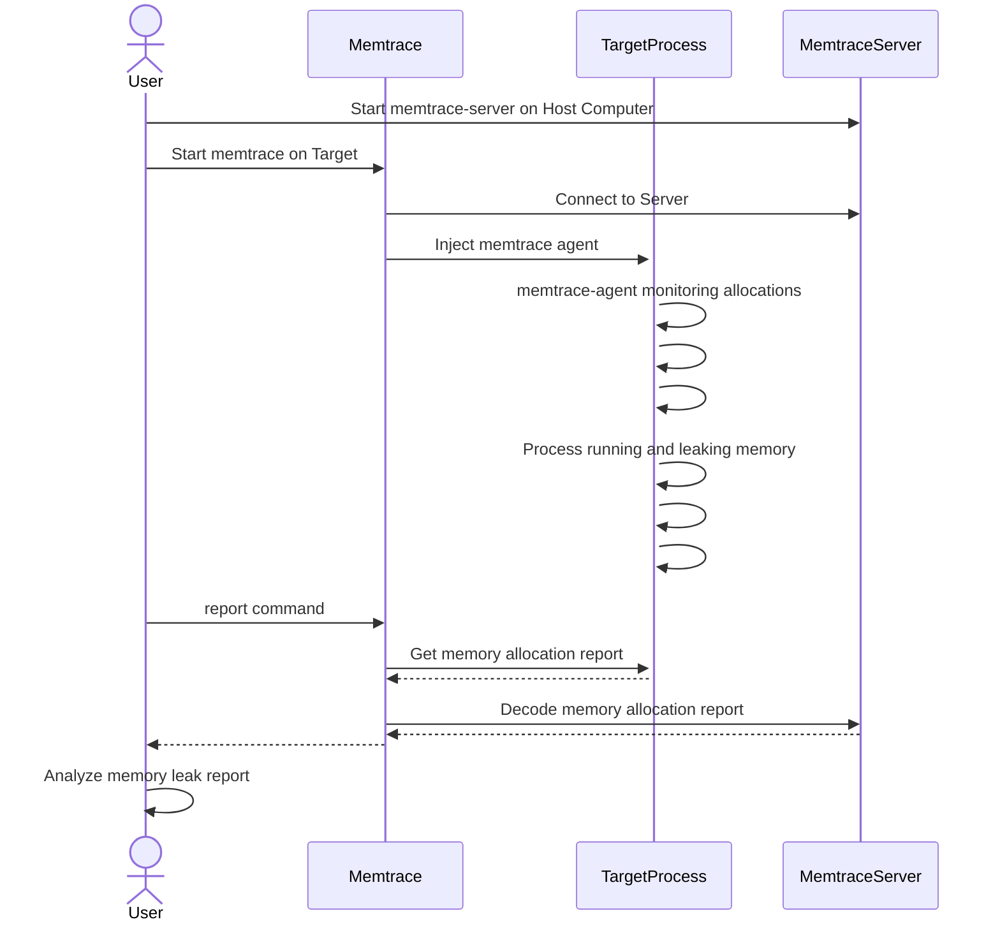
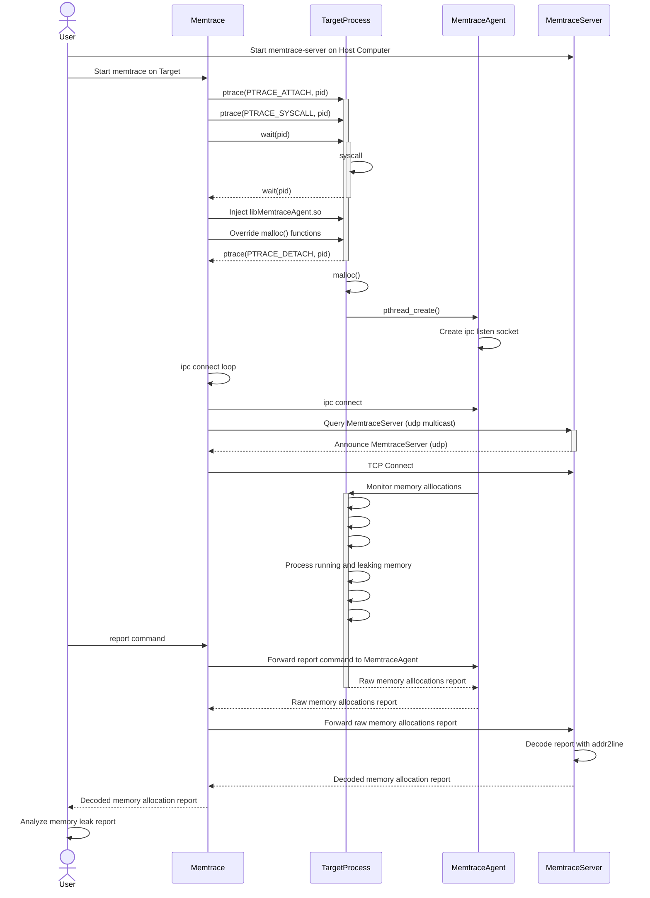

## 1. Overview
memtrace is a memory leak cross-debugger for Linux Embedded Systems.

You can simply attach to a target process with `memtrace -p $pid`.

To benefit from backtraces with debug symbols, you can also start a memtrace-server on your Host computer.

It's main advantages are:

- It can be attached to a process already running
- Cross-debugging (No debug symbols needed on the target process)
- gdb support for inspecting memory allocation context
- Supported Platforms: x64, arm

## 2 Compilation
```
$ cd memtrace
$ export CC=arm-linux-gnueabi-gcc
$ make
$ sudo make install  # install memtrace-server on Host computer
```

## 3 Install memtrace on target platform
```
# Move in the build directory
$ cd memtrace/build-XXXX

# Install memtrace agent and memtrace itself on target in the same folder.
$ scp libmemtrace-agent.so $hostname-target:/tmp/
$ scp memtrace $hostname-target:/tmp/

# On some Embedded Linux, you may not have any writable partition with execution rights.
# So, you may need to give a partition with execution rights:
$ mount -o remount,exec /tmp/
```

## 4. Debugging with Memtrace
### 4.1 General usage


### 4.2 Usage in local network for Cross-debugging.
```
# Start memtrace-server on Host.
# The service will listen on port 3002 and annouce itself with multicast.
# The service allow memtrace to retrieve debug symbols from build directory
guillaume@ubuntu:~$ memtrace-server output/staging/
Adding directory output/staging/ to search path
Listening on [0.0.0.0]:3002

# Attach memtrace to process on Target
# memtrace will:
# - inject the agent in target process to follow memory allocations
# - connect to the agent through ipc socket
# - discover server with a multicast query
# - connect to the server
/cfg/system/root # /tmp/memtrace -p $(pidof dnsmasq) --multicast


# In case multicast is filtered on your network, you can specify directly the IP Address of the server:
/cfg/system/root # /tmp/memtrace -p $(pidof dnsmasq) --connect 192.168.1.101:3002
```

### 4.3 Non local nework
When target is not running on local network, memtrace can not rely on multicast to discover memtrace-server .
In this case, it is useful to start memtrace as a tcp server and memtrace-server as a tcp client. Roles can be inverted if needed.

```
# Attach memtrace to process on Target
# memtrace will listen on tcp port 3002 and wait for memtrace-fs to connect
/cfg/system/root # /tmp/memtrace -p $(pidof dnsmasq) -l 0.0.0.0
Listening on [0.0.0.0]:3002
Waiting for client to connect

# Ask memtrace-server on Host to connect to memtrace on Target
guillaume@ubuntu:~$ memtrace-server -c targethostname.com  workspace/ib3_12.02.12/output/staging/
Adding directory workspace/ib3_12.02.12/output/staging/ to search path
Connect to [targethostname.com]:3002
Connecting to [targethostname.com]:3002
Connected

# You should now have the hand on Target
```

### 4.4 Offline Usage
When memtrace client has no possibility to connect to memtrace server, it is possible to start memtrace 'offline'.
/ # /tmp/memtrace -p $(pidof dummy) 

You can still generate 'report' but you will need to decode it offline with memtrace-server.

```
/ # /tmp/memtrace -p $(pidof dummy) 
Try to find /usr/lib/libmemtrace-agent.so
Try to find /tmp/libmemtrace-agent.so
Memtrace agent is /tmp/libmemtrace-agent.so
Memtrace agent is already injected in target process
Memtrace is connected to target process 14612
Enter 'help' for listing possible commands

> report
memtrace report:
[sysroot]/path/to/sysroot
[toolchain]/path/to/toolchain
Memory allocation context n°0
185 allocs, 1295 bytes were not free
[addr]/lib/libc.so.6+0x70ed8 | __libc_malloc()+0x0
[addr]/lib/libc.so.6+0x753e0 | __strdup()+0x18
[addr]/tmp/dummy+0x1092c
[addr]/tmp/dummy+0x10924
[addr]/tmp/dummy+0x1084c | thread_loop()+0x44
[addr]/lib/libpthread.so.0+0x5f14
[addr]/lib/libc.so.6+0xd0658
[addr]/tmp/dummy+0x10808 | thread_loop()+0x0
[addr]/lib/libc.so.6+0x10e508
[addr]/lib/libc.so.6+0x10eb08
[addr]/lib/libc.so.6+0x10f408

HEAP SUMMARY Sun Jun 11 16:21:36 2023

    in use: 185 allocs, 1295 bytes in 1 contexts
    total heap usage: 370 allocs, 185 frees, 2220 bytes allocated
    memory leaked since last hour: 0 allocs, 0 bytes

memtrace-server --report /path/to/encoded/report build-arm-buildroot-linux-gnueabi/dummy
__libc_malloc() in /opt/arm-buildroot-linux-gnueabi/sysroot//lib/libc.so.6
__strdup() in /opt/arm-buildroot-linux-gnueabi/sysroot//lib/libc.so.6
deregister_tm_clones() in build-arm-buildroot-linux-gnueabi/dummy
deregister_tm_clones() in build-arm-buildroot-linux-gnueabi/dummy
main() in /home/sahphilog2/Workspace/memtrace/src/dummy.c:62
start_thread() in /opt/arm-buildroot-linux-gnueabi/sysroot//lib/libpthread.so.0
clone() in /opt/arm-buildroot-linux-gnueabi/sysroot//lib/libc.so.6
main() in /home/sahphilog2/Workspace/memtrace/src/dummy.c:99
```

## 5. Console Usage
memtrace provide a console to inspect the HEAP usage. It currently offers the following commands:
```
> help
List of commands:
       help: Display this help
       quit: Quit memtrace and show report
     status: Show memtrace status
    monitor: Monitor memory allocations. monitor --help for more details.
     report: Show memtrace report. report --help for more details.
  logreport: Log reports at a regular interval in specified file. log --help for more details.
   coredump: Mark a memory context for coredump generation. coredump --help for more details.
      break: Break on specified function.
      clear: Clear memory statistics

```

### 5.1 Show HEAP summary
This command allow to show the HEAP status.
  
Following the HEAP status evolution may help to detect when a program is leaking meory.
```
> status
HEAP SUMMARY Wed Feb 23 16:31:51 2022

    in use: 0 bytes in 0 blocks
    total heap usage: 205 allocs, 205 frees, 51885 bytes allocated
```

### 5.2 Clear current statistics
```
> clear
Clearing list of allocations
>
> status
HEAP SUMMARY Wed Feb 23 16:32:08 2022

    in use: 0 bytes in 0 blocks
    total heap usage: 0 allocs, 0 frees, 0 bytes allocated
>
```

### 5.3 Monitor the HEAP status
```
> monitor --help
Usage: monitor [OPTION]..
Toggle ON/OFF the monitoring of the process
  -h, --help             Display this help
  -i, --interval=VALUE   Start monitoring at the specified interval value in seconds
  -s, --stop             Stop monitoring
> 
> monitor
> HEAP SUMMARY Sun Jun 11 16:12:42 2023

    in use: 66 allocs, 462 bytes in 1 contexts
    total heap usage: 132 allocs, 66 frees, 792 bytes allocated
    memory leaked since last hour: 0 allocs, 0 bytes
HEAP SUMMARY Sun Jun 11 16:12:45 2023

    in use: 69 allocs, 483 bytes in 1 contexts
    total heap usage: 138 allocs, 69 frees, 828 bytes allocated
    memory leaked since last hour: 0 allocs, 0 bytes
HEAP SUMMARY Sun Jun 11 16:12:48 2023

    in use: 72 allocs, 504 bytes in 1 contexts
    total heap usage: 144 allocs, 72 frees, 864 bytes allocated
    memory leaked since last hour: 0 allocs, 0 bytes
HEAP SUMMARY Sun Jun 11 16:12:51 2023
```

### 5.4 Show complete HEAP report with backtrace of each allocation
```
> report -h
Usage: report [OPTION]..
Generate a memory usage report
  -h, --help             Display this help
  -c, --count=VALUE      Count of memory contexts to display (default:10)
```

### 5.5 Generate a coredump for post-mortem analysis
```
> coredump --help
Usage: coredump [OPTION]..
Mark a memory context for coredump generation
  -h, --help             Display this help
  -c, --context=VALUE    Mark the specified memory context for coredump generation (default:core.20328)
  -n, --now              Generate a breakpoint, now !
  -f, --file=PATH        Write the coredump to the specified path

> coredump -c 0 -f /tmp/core
Attaching to 20328
memtrace attached to pid:20328/tid:20328
memtrace attached to pid:20328/tid:20330
memtrace attached to pid:20328/tid:21299
Setting breakpoint on malloc_hook at 0x55860 (/tmp/libmemtrace-agent.so+0x5860)
Breakpoint was hit !
Writing coredump to /tmp/core
Writing coredump done
Detaching from 20328
```

### 5.6 Log reports periodically
Let's say you have an hard time to track a memory leak which manifests after quite a long time.

In this case, you may want to let run memtrace for few hours or even few days without any active supervision.

For this purpose, you may simply ask memtrace to run reports periodically until you stop it or until OOM killer or kernel panic kicks-in.

```
> logreport -h
Usage: log [OPTION].. [FILE]
Log reports at a regular interval to the specified file. (default is /ext/memtrace-2630.log)
  -h, --help             Display this help
  -i, --interval=VALUE   Start monitoring at the specified interval value in seconds
  -c, --count=VALUE      Count of print memory context in each report
  -f, --foreground       Keep memtrace in foreground

> logreport --interval 600 memtrace-endurance-test.log
memtrace logs report every 600s in memtrace-endurance-test.log

Daemonize memtrace
```

The report logger will run as a background task by default.
You will need to kill it by hand if you want to stop it:
```
/cfg/system/root # ps | grep memt
12232 root      1944 S    /tmp/memtrace -p 2630 
12564 root      2004 S    grep memt 
/cfg/system/root #
/cfg/system/root # killall memtrace
```


### 6. Experimental support with dataviewer
It is possible to plot the top 10 memory allocations usage over the time with dataviewer.
For that purpose, you can use the 'dataviewer' command in memtrace's cli.

Prequites to use dataviewer are:
- Install rust toolchain:
```
curl --proto '=https' --tlsv1.2 -sSf https://sh.rustup.rs | sh"
```
- Install GTK4 dependency:
```
sudo apt install libgtk-4-dev
```
- Install dataviewer itself from rust package manager:
```
cargo install dataviewer --locked
```


https://github.com/guillaumepellegrino/dataviewer

### 7. Architecture


- memtrace inject an agent in the target process and override all memory allocations functions (malloc, calloc, realloc, free) with ptrace.
- The agent maintains the statistics and the callstack of the memory allocations done by the target process.
- memtrace can be attached to a process without debug symbols (Example: Embedded systems with limited flash memory)
- memtrace query the agent (status, report) through an ipc socket.
- memtrace-server provide addr2line and gdb tools to memtrace for callstack analysis


## 7. TODO
- Improvement idea: provide a cli command which allow to automatically generate a tar.gz archive containing:
-- the memtrace report
-- the coredump(s) of the context(s) with the highest memory usage.
-- maybe some details about the tracked process and the OS version
-- maybe something to plot the memory usage with dataviewer ?
-- the likelyhood of a memory leak (yes or not, percentage ?)
-- => autoreport --file report.tar.gz --duration TIME --maxcores 3 --coretimeout TIMEOUT
-- => it may be useful for support team which could simply run this command and provide the detailed report to the DEV team. It may even allow to automate things.

